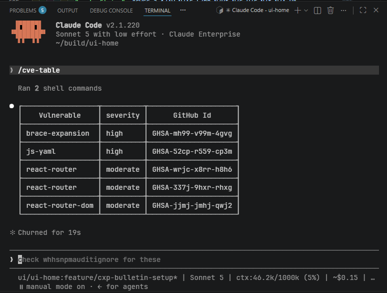

# cve-table

Runs `npm audit` and renders its advisories as a Markdown table, so a batch of dependency vulnerabilities can be scanned and triaged at a glance instead of read one by one from JSON.



## 📌 What it's for

`npm audit` output is verbose and nested — useful for tooling, slow for a human to skim. This skill:

- Runs `npm audit --json` in the current project
- Extracts each advisory's package name, severity, and GitHub advisory id via `render-table.js`
- Prints a `Vulnerable | severity | GitHub Id` table (or a clear "no advisories" message on a clean audit)

## 🚀 When to use it

- You want a quick, shareable list of current CVE/advisory ids to triage or file as "ignored, tracked."
- Before a release, to eyeball what `npm audit` is currently flagging without wading through the raw JSON.

Not for: fixing vulnerabilities or running `npm audit fix` — this only reports.

## 🛠️ Usage

```
/cve-table
```

Runs against the current working directory's `package.json`/lockfile. No arguments.
