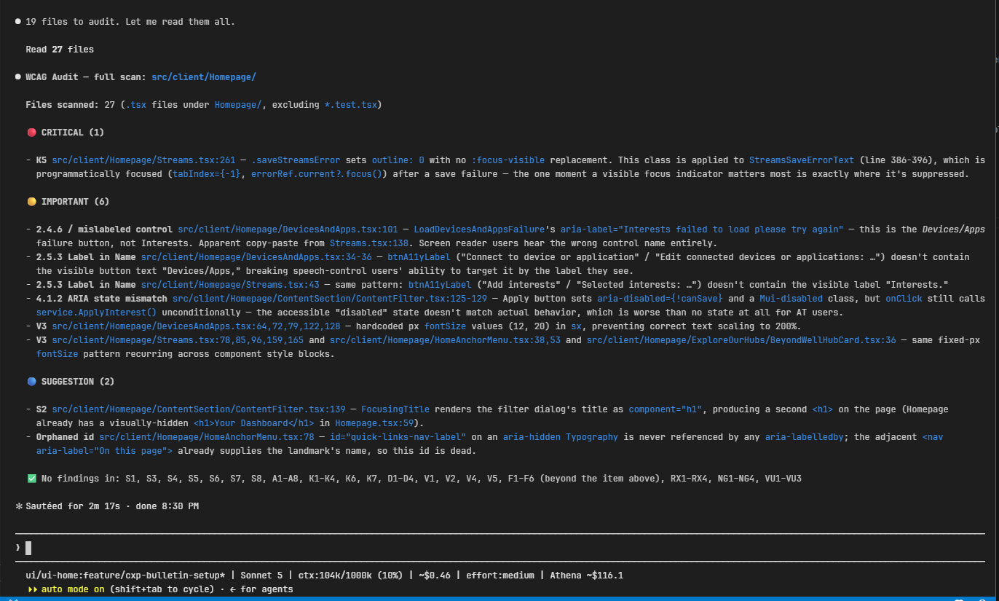

# wcag-audit: WCAG 2.2 Accessibility Auditor



Audits your UI code against WCAG 2.2 AA accessibility guidelines — 38+ anti-patterns across the POUR categories (Perceivable, Operable, Understandable, Robust), checked in a single pass and reported by severity.

> **Recommended model: Sonnet 5, effort `low` or `medium`.** This audit is pattern-matching against a bundled ruleset, not open-ended reasoning — low/medium effort is plenty accurate and meaningfully cheaper/faster than high effort. Reserve higher effort for very large full-repo scans where cross-file synthesis gets harder.

> **Read [Limitations](#-limitations) before relying on results.** No auto-fix, no CI integration, contrast detection needs explicit hex/rgb, AA-only, web-only, and large scans (100+ files) may hit context limits.

## 📌 What it's for

- **Default mode** — audits only staged git changes (fast, pre-commit safe)
- **Full scan** — audits the entire repo, or a specific folder
- **Framework support** — React/Next.js, Angular, Vue, vanilla HTML/CSS
- **Comprehensive coverage** — semantic HTML, ARIA, keyboard/focus, forms, visual, media, and framework-specific patterns
- **Report-only** — no auto-fix, every finding is human-reviewed

Reads the bundled `rules/a11y.md` once and checks every collected file against the full ruleset in a single pass — a single reviewer catches cross-category overlaps (e.g. a clickable `<div>` is both S8 "no semantic HTML" and K1 "no keyboard handler" on the same line) that splitting the audit across sub-agents would duplicate or half-miss.

## 🚀 When to use it

### Staged changes (default)

```
/wcag-audit
```

Audits only the files you've staged with `git add`. If nothing is staged, the skill stops with a clear message instead of scanning the whole repo.

### Full repo scan

```
/wcag-audit full
```

Audits the entire repository, filtering to UI file types (`.tsx`, `.jsx`, `.html`, `.vue`, `.css`, `.scss`).

### Scoped scan

```
/wcag-audit full src/components
```

Audits a specific folder — useful for a subsystem without scanning the whole repo, and the recommended path once a repo passes ~100 UI files.

## 🛠️ Usage

Output is a single Markdown report, grouped by severity:

```markdown
## WCAG Audit — staged diff

### 🔴 CRITICAL (2)
- **S8** `src/Button.tsx:42` — Interactive div with onClick but no role or keyboard handler
- **F1** `src/Form.tsx:18` — Input without associated label

### 🟡 IMPORTANT (3)
- **K4** `src/App.tsx:5` — No skip link as first focusable element
- **V3** `src/styles.css:24` — Fixed font-size preventing resize

### 🔵 SUGGESTION (1)
- **V5** `src/Card.css:12` — Animation without prefers-reduced-motion guard

✅ No findings in: Operable, Understandable
```

- **🔴 CRITICAL** — users cannot access content; fix before merge
- **🟡 IMPORTANT** — significant barrier for assistive tech users; fix in the same sprint
- **🔵 SUGGESTION** — improves usability; plan for a future iteration

| Codes | Category |
|-------|----------|
| S1–S8 | Semantic HTML |
| D1–D4 | Media (decorative/informational) |
| V1–V5 | Visual and color |
| K1–K7 | Keyboard and focus |
| F1–F6 | Forms, labels, error handling |
| A1–A8 | ARIA |
| RX1–RX4 | React/Next.js |
| NG1–NG4 | Angular |
| VU1–VU3 | Vue |

## 🛡️ Limitations

- **No auto-fix** — findings are always human-reviewed.
- **No CI integration** — built for interactive Claude Code use; for pipelines, use `axe-core` or `eslint-plugin-jsx-a11y`.
- **Contrast detection** — requires explicit hex/rgb colors in source; rendered DOM or design-token resolution isn't supported.
- **AA only** — targets WCAG 2.2 AA; AAA criteria aren't included.
- **Web only** — React Native, Flutter, and other native targets are out of scope.
- **Very large scans** — a single pass over 100+ UI files may hit context limits; scope to a folder instead.
